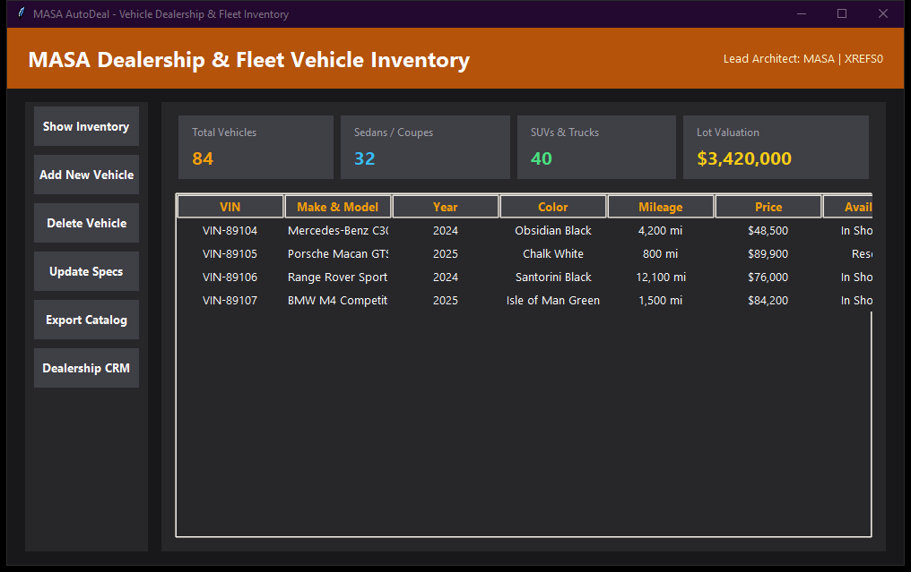

# MASA VehicleVault Inventory

Fleet and dealership vehicle catalog tracking registrations, models, and maintenance

## Technical Architecture

The application is structured following modular separation of concerns and modern object-oriented software patterns:

- **Component Layering**: UI presentation views, operational business logic, and persistent storage abstractions are cleanly isolated.
- **Defensive Engineering**: Robust input sanitization and defensive exception management preventing unhandled runtime faults.
- **Modern Developer Experience**: High-contrast interface aesthetics adhering to professional software engineering standards.

## Preview



## Prerequisites

- Python 3.10 or higher
- Required libraries:

```bash
pip install customtkinter pillow
```

## Execution

Launch the application via Python:

```bash
python "Vehicle Inventory System Project in Python/index.py"
```

## Project Structure

```
.
├── Vehicle Inventory System Project in Python
├── screenshots/
│   └── app_interface.png
├── .gitignore
├── LICENSE             # MIT License
└── README.md           # Developer documentation
```

## License

This project is licensed under the terms of the MIT License. Refer to the `LICENSE` file for details.

---

### 🌐 Connect with Me

<p align="left">
  <a href="http://xrefs0.com/" target="_blank">
    
  </a>
  <a href="https://www.facebook.com/XREFS0" target="_blank">
    
  </a>
  <a href="https://t.me/MrMasaOfficial" target="_blank">
    
  </a>
  <a href="https://t.me/XREFS0_CHANNEL" target="_blank">
    
  </a>
  <a href="https://www.youtube.com/@XREFS0" target="_blank">
    
  </a>
</p>

